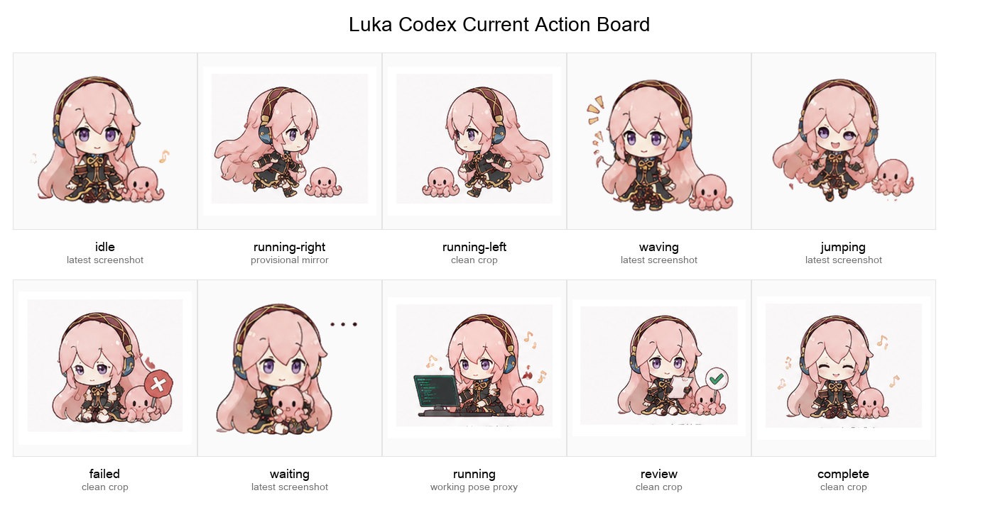

# Luka Codex Pet

An installable custom Codex desktop pet inspired by a gentle pink-haired singer mascot with a small pink octopus helper.

This repository includes a ready-to-install Codex pet package plus the local scripts used to rebuild the transform-based spritesheet.



## Quick Install

Clone the repository, then run the installer from the project root.

macOS or Linux shell:

```bash
python3 scripts/install_pet.py
```

Windows PowerShell:

```powershell
.\scripts\install_pet.ps1
```

The installer copies the package to:

```text
${CODEX_HOME:-$HOME/.codex}/pets/luka-codex/
  pet.json
  avatar.json
  spritesheet.webp
```

After installing, restart or refresh Codex pets in the Codex app, then select `luka-codex` from Settings > Appearance > Pets.

## Included Package

The prebuilt package lives in `package/`:

```text
package/
  pet.json
  avatar.json
  spritesheet.webp
```

The package is enough for normal use. You do not need to rebuild the spritesheet unless you want to change the animation.

## Action Mapping

Codex reads the pet as a 9-row spritesheet. The current Luka package uses this mapping:

| Row | State | Frames | Meaning |
| --- | --- | ---: | --- |
| 0 | `idle` | 6 | Default resting loop |
| 1 | `running-right` | 8 | Drag or movement to the right |
| 2 | `running-left` | 8 | Drag or movement to the left |
| 3 | `waving` | 4 | Greeting or attention gesture |
| 4 | `jumping` | 5 | Jump reaction |
| 5 | `failed` | 8 | Failed, blocked, or cancelled work |
| 6 | `waiting` | 6 | Waiting for user input or approval |
| 7 | `running` | 8 | Codex is actively processing work |
| 8 | `review` | 6 | Output is ready to review |

`running` means Codex is working. It is not triggered by normal manual file editing.

## Optional Runtime Patch

Codex can load the pet without patching the app. The optional runtime patch does two extra things:

- lets custom pets play the `running` row as 8 frames
- makes `waving` and `review` show up more often for notification states

macOS or Linux shell:

```bash
python3 scripts/install_pet.py --patch-runtime
```

Windows PowerShell:

```powershell
.\scripts\install_pet.ps1 --patch-runtime
```

The patch script creates a local backup before changing Codex's `app.asar`. If Codex updates, rerun the patch command.

## Rebuild From Source Frames

Install Python dependencies first:

```bash
python3 -m pip install -r requirements.txt
```

Then rebuild and install:

```bash
python3 scripts/package_transform_pet.py --install
```

Windows PowerShell:

```powershell
.\scripts\package_transform_pet.ps1 --install
```

Rebuild outputs are written under `runs/luka-codex/`, and the final installable files are refreshed under `package/`.

## Notes

- This is an unofficial fan-made custom pet package.
- The motion pipeline uses transform-based frame generation from current action images, not cropped sprite strips.
- Generated QA files include a contact sheet and per-frame validation when rebuilding.
